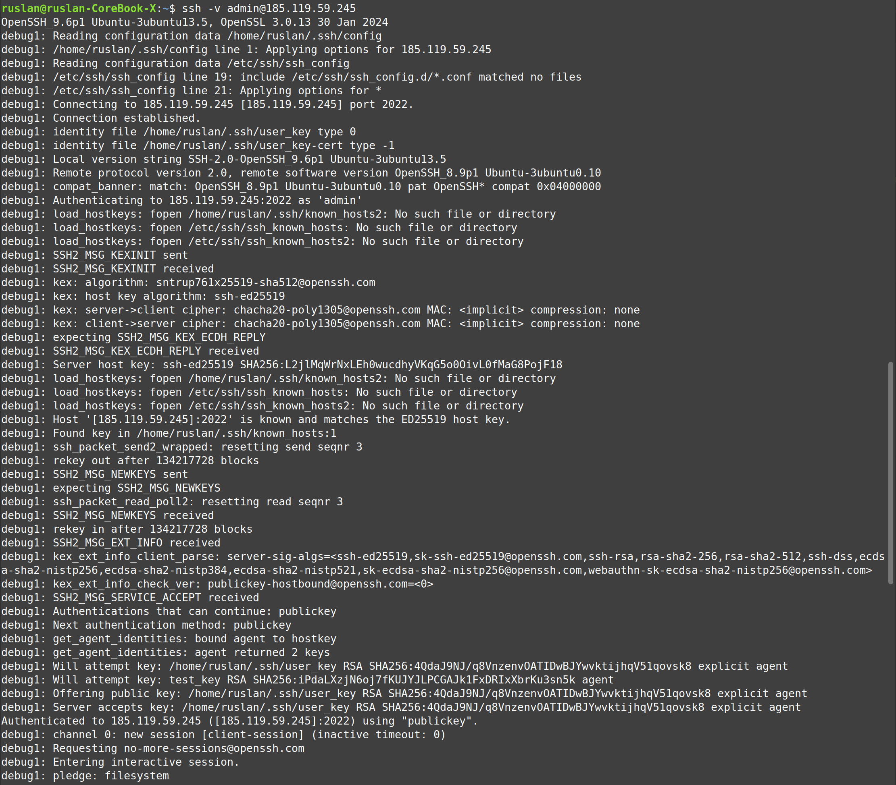
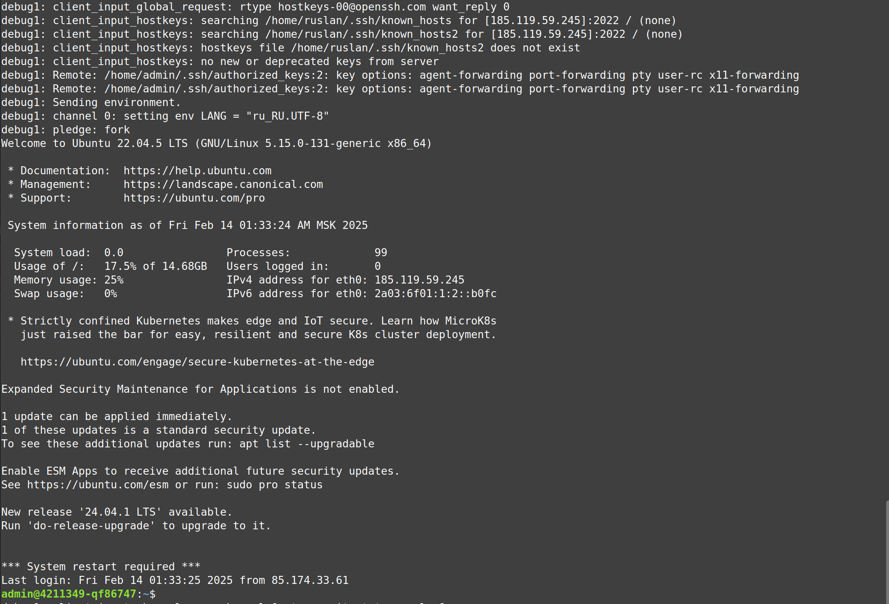
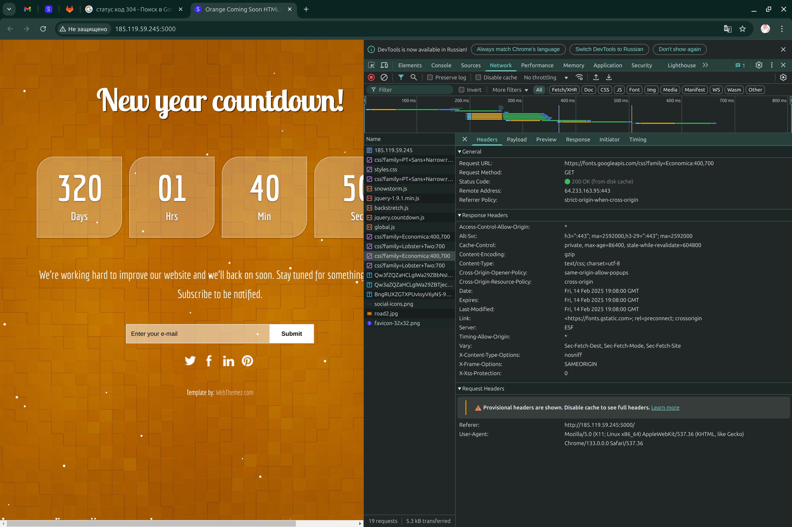

# Практическая работа 8
## Цель практической работы
Научиться:
* деплоить сайт на удалённый сервер;
* настраивать доступ к серверу по SSH;
* создавать новых пользователей;
* пользоваться утилитами scp и rsync.


## Что входит в практическую работу
1. Создание пользователя.
2. Конфигурация SSH-подключения.
3. Деплой сайта.
4. Let it snow!
5. Раздача статики.


## Задача 1. Создание пользователя
### Что нужно сделать
Многопользовательская архитектура даёт возможность управлять правами доступа для выполнения различных действий. Если бы все пользователи обладали столь широкими правами, крах системы был бы неизбежен. Поэтому необходимо обезопасить систему. Кроме того, чтобы система стала по-настоящему удобной, каждому пользователю необходимо пространство, которое доступно только ему.

Потренируемся в организации такой архитектуры.

1. Создайте локально новый файл с `rsa`-ключом.
2. Создайте на удалённой машине нового пользователя командой `adduser`.
3. Сделайте так, чтобы войти под новым пользователем можно было командой SSH по ключу, созданному в пункте 1.
4. Подключитесь по `ssh` с опцией `-v` и с помощью созданного ключа без ввода пароля. Сделайте скриншот с логом подключения.


5. Удалите нового пользователя с помощью команды `deluser`.

В качестве решения приложите скриншот, сделанный в пункте 4.

### Советы и рекомендации
Изучите мануалы [adduser](https://www.opennet.ru/man.shtml?topic=adduser&category=8&russian=0) и 
[deluser](https://www.opennet.ru/cgi-bin/opennet/man.cgi?topic=deluser&category=8).

### Что оценивается
При подключении к серверу не запрашивается пароль.

## Задача 2. Конфигурация SHH-подключения
### Что нужно сделать
Довольно неудобно каждый раз добавлять путь к ключу при подключении к серверу. 
Да и указывать его в rsync тоже немного неприятно.
Давайте это исправим.
1. На локальной машине создайте папку ~/.ssh и задайте на неё права:<br>
```shell
$ mkdir -p ~/.ssh
$ chmod 700 ~/.ssh
```
2. Создайте в папке `~/.ssh` файл с именем config:
```shell
$ touch ~/.ssh/config && chmod 600 ~/.ssh/config
```
3. Скопируйте приватный и публичный ключи в папку `~/.ssh/`:
```shell
$ cp -fv timeweb timeweb.pub ~/.ssh/
$ chmod 600 ~/.ssh/timeweb*
```
4. Отредактируйте файл `~/.ssh/config`, написав следующие строки:
```
Host <ip_address_of_your_machine>
  User <your_remote_system_user_name>
  IdentityFile ~/.ssh/timeweb
  ```
5. Подключитесь по ssh с опцией -v, сделав скриншот с логом подключения:
```shell
$ ssh <your_remote_system_user_name>@<ip_address_of_your_machine>
```


В качестве решения приложите скриншот, сделанный в пункте 5.

### Советы и рекомендации
[Что такое 600 и 700 в chmod](https://www.opennet.ru/man.shtml?category=1&topic=chmod)

### Что оценивается
Для подключения к серверу не указывается путь к ключу.

## Задача 3. Деплой сайта
### Что нужно сделать
Запускать сайт на localhost, конечно, интересно, но ещё лучше, когда этот сайт может увидеть каждый, подключившись к нему удалённо через браузер.

Сделайте деплой сайта, который находится в материалах к занятию в папке *new_year_application*.

## Задача 4. Let it snow
Мы успешно задеплоили сайт, который показывает количество дней до Нового года. 
Давайте сделаем его красивее!
Добавьте на сайт снежинки, падающие сверху страницы, которые реализованы 
[в этой библиотеке](https://github.com/scottschiller/snowstorm/).

Инструкция:
1. Скачайте в локальную папку /js/ скрипт со снежинками snowstorm.js.
2. Подключите этот файл в *index.html*, указав сразу после `<!--Scripts–>` новый JS-файл:
```shell
<script type="text/javascript" src="/js/snowstorm.js"></script>
```
3. Убедитесь, что на локальном сайте появились снежинки.
4. Задеплойте сайт на удалённый сервер. Убедитесь, что всё работает.


В качестве решения приложите скриншот с работающим удалённым сайтом.
### Что оценивается
* На удалённом сайте появились снежинки.
* На скриншоте виден URL страницы.

## Задача 5. Раздача статики
### Что нужно сделать
Создавать endpoint под каждую папку со статическими файлами непрактично. Обычно делают так, чтобы по URL `/static` можно было получить любой из них, будь то картинка, 
скрипт или таблица стилей.

Проведём эту операцию над нашим сайтом:

1. В папке с приложением создайте папку `/static`.
2. Перенесите в неё папки `/css`, `/js` и `/images`.
3. Измените `url` до статических файлов в `index.html`, добавив в начало каждого url `/static`.
4. Удалите endpoint'ы `send_css`, `send_js` и `send_images`, заменив их на самореализованный endpoint `send_static` (он должен уметь обрабатывать URL, начинающийся со `/static`).
5. Убедитесь, что на локальном сайте всё работает.
6. Задеплойте сайт на удалённый сервер. Убедитесь, что всё работает.


В качестве решения приложите скриншот, показывающий, что запросы сайта на статику посылаются на URL `/static`. Сделать это можно двумя способами:


1. Показать логи сервера. При подключении к сайту должно выводиться что-то подобное:<br>`"GET /static/css/styles.css HTTP/1.1" 200 -`


2. Показать URL запросов в инструментах разработчика. Запросы к серверу находятся во вкладке «Сеть/Network». Далее нужно поставить фильтр «Все/All», нажать на какой-либо запрос и посмотреть Headers.<br>`GET http://<YOUR_SITE>/static/js/jquery-1.9.1.min.js`



### Советы и рекомендации
* Создайте переменную `static_directory`, указывающую на папку, из которой будет идти раздача файлов.
* [Обзор инструментов разработчика Chrome DevTools](https://habr.com/ru/company/simbirsoft/blog/337116/). В других браузерах принципиальных отличий не будет.


### Что оценивается
* На удалённом сайте всё по-прежнему работает.
* На скриншоте показано, что запросы к серверу посылаются на URL `/static`.


## Общие советы и рекомендации
* Если нужно продемонстрировать работу сервиса заказчику, а с удалённым сервером возиться не хочется, можно воспользоваться утилитой `ngrok`. Она позволяет пользователям подключиться по общедоступному URL к локально размещённому веб-приложению. Прочтите, [как ей пользоваться](https://highload.today/ngrok-localtunnel/).
* Не пренебрегайте использованием `rsync`. Это мощная утилита, которая поможет эффективно выполнить синхронизацию файлов с сервером. Шпаргалка по её использованию находится в описании занятия 8.5.


## Что оценивается в практической работе
* Для решения задач используется реальный удалённый сервер.
* Представлены скриншоты, показывающие, что задачи выполнены успешно.
